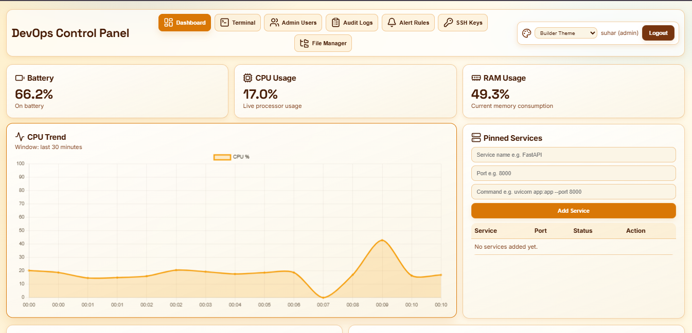
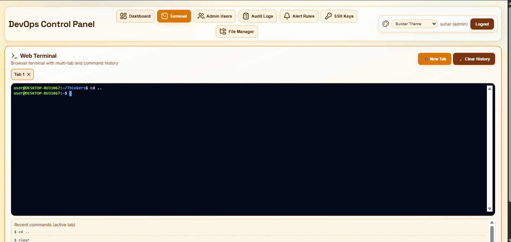
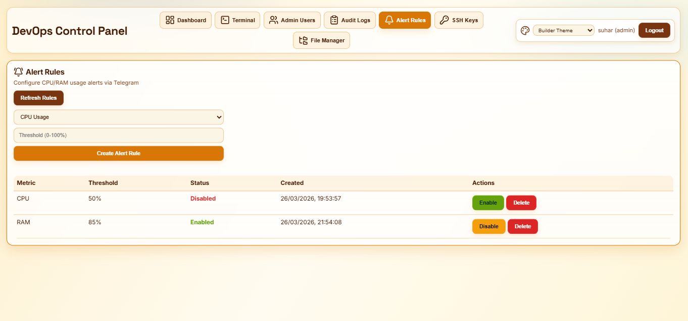
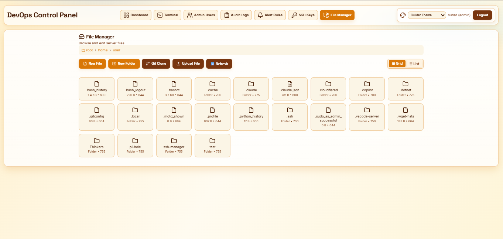

# DevOps Control Panel


A full-stack operations dashboard built with **FastAPI + SQLite + vanilla HTML/CSS/JS**.

It provides:
- Role-based login/authentication (`viewer`, `operator`, `admin`)
- Live system metrics (battery, CPU, RAM)
- Open ports and Docker visibility
- Managed service run/stop + logs.
- To-do tracking for ops tasks
- Audit logs and alert rules
- Admin SSH public key manager (writes managed `authorized_keys` block)
- Admin Cloudflared route manager (writes managed `ingress` block in config)
- Admin file manager (browse/read/write/upload/download/chmod)
- File manager Git clone action (clone repos into current folder)
- Browser terminal via WebSocket + PTY
- Saved command library with template variables (`{{var}}`)
- Port change detection (newly opened / recently closed)
- Telegram alerts when pinned ports go down

---

## Table of Contents

1. [Project Overview](#project-overview)
2. [Tech Stack](#tech-stack)
3. [Repository Structure](#repository-structure)
4. [How It Works](#how-it-works)
5. [Roles and Permissions](#roles-and-permissions)
6. [Environment Variables](#environment-variables)
7. [Setup and Run](#setup-and-run)
8. [API Reference](#api-reference)
9. [UI Screenshots](#ui-screenshots)
10. [Frontend Modules](#frontend-modules)
11. [Database Schema](#database-schema)
12. [Security Notes](#security-notes)
13. [Operational Workflows](#operational-workflows)
14. [Troubleshooting](#troubleshooting)
15. [Known Limitations](#known-limitations)
16. [Future Improvements](#future-improvements)

---

## Project Overview

This project is an operational dashboard intended for local/server administration tasks. It includes:

- **Authentication + RBAC**
  - Sessions stored in-memory, cookie-based auth
  - User records in SQLite
- **Monitoring**
  - CPU/RAM from `psutil`
  - Battery state and threshold alerts
  - Open port scan via `ss -tuln`
  - Pinned-port health checks (`127.0.0.1:<port>`)
  - Docker process listing via `docker ps`
- **Service Control**
  - Start/stop custom service commands
  - Log persistence under `logs/`
- **Admin Management**
  - User lifecycle
  - Audit logs
  - Alert rules
  - Cloudflared hostname-to-port routes
  - File manager APIs
- **Terminal**
  - Browser terminal over WebSocket and PTY shell
- **Productivity Features**
  - Saved commands
  - Template variables in commands
  - Port diff/change visualization

---

## Tech Stack

### Backend
- Python 3
- FastAPI
- SQLite (`users.db`)
- `psutil`
- `requests`
- Native Linux tools:
  - `ss` for ports
  - `docker` CLI for containers
- PTY terminal utilities (`pty`, `fcntl`, `os`, `signal`)

### Frontend
- Single-page `index.html` (no framework)
- Chart.js (CPU trend)
- xterm.js (web terminal)
- Lucide icons
- Responsive CSS + container queries + themed UI

---

## Repository Structure

```text
/home/user/test
├── main.py                # FastAPI app (API + auth + RBAC + terminal + files + alerts)
├── index.html             # Full frontend UI and client-side logic
├── battery.py             # Optional battery monitor script using /notify API
├── .env.example           # Environment template (copy to .env)
├── users.db               # SQLite database (local runtime, gitignored)
├── logs/                  # Service log files (gitignored)
├── docs/screenshots/      # README UI screenshot assets
├── cloudflared/
│   └── config.example.yml # Optional sample cloudflared config template
├── LICENSE                # Open-source license
├── CONTRIBUTING.md        # Contribution guidelines
└── venv/                  # Local Python virtual environment
```

---

## How It Works

1. **Startup**
   - `main.py` loads `.env`
   - Initializes DB tables
   - Bootstraps admin user if missing
2. **Authentication**
   - Login creates random session token
   - Token stored in HTTP-only cookie
   - Session metadata stored in-memory (`active_sessions`)
3. **Authorization**
   - `require_role()` guards endpoints with role ranking
4. **Frontend**
   - `GET /` serves `index.html`
   - JS frontend fetches API routes with cookie credentials
5. **Monitoring Loop**
   - Frontend periodically calls refresh endpoints every ~3s once logged in
6. **Alerts**
   - CPU/RAM alert thresholds checked in `/system`
  - Pinned-port down checks also run in `/system`
   - Telegram notification sent with cooldown logic

---

## Roles and Permissions

| Role     | Access |
|----------|--------|
| viewer   | Read dashboards, metrics, logs, ports, docker, state |
| operator | viewer + service run/stop, todo edit, terminal, file download |
| admin    | operator + users, audit, alert rules, ssh keys, cloudflared routes, file manager read/write/delete/upload/chmod, notify, docs |

### Special behavior
- Last admin cannot be deleted/demoted.
- Users cannot delete their own account.
- API docs (`/docs`, `/redoc`, `/openapi.json`) are restricted to admin.

---

## Environment Variables

Defined/used in backend:

- `BOT_TOKEN` — Telegram bot token
- `CHAT_ID` — Telegram chat ID
- `SESSION_TIMEOUT_MINUTES` — Session TTL in minutes (minimum effective 1 minute)
- `USERS_DB_PATH` — SQLite DB file path (default `users.db`)
- `ADMIN_USERNAME` — bootstrap admin username
- `ADMIN_PASSWORD` — bootstrap admin password (min 8 chars)
- `CLOUDFLARED_CONFIG_PATH` — Cloudflared config file path (default `/etc/cloudflared/config.yml`)
- `CLOUDFLARED_FALLBACK_CONFIG_PATH` — writable fallback path if primary path is not writable (default `./cloudflared/config.yml`)
- `CLOUDFLARED_TUNNEL_NAME` — tunnel name/UUID for automatic DNS routing from UI
- `CLOUDFLARED_DNS_AUTO_ROUTE` — auto-run `cloudflared tunnel route dns` on route create (`true` by default)
- `CLOUDFLARED_BIN_PATH` — cloudflared executable path (default `cloudflared`)
- `CLOUDFLARED_DNS_ROUTE_TIMEOUT_SECONDS` — DNS command timeout (default `20`)

If writing to `/etc/cloudflared/config.yml` fails (common on non-root setups), the app automatically tries the fallback path.

### Important
Never commit real credentials. Keep `.env` local and only share placeholder values in `.env.example`.

---

## Setup and Run

## 1) Python environment

```bash
python3 -m venv venv
source venv/bin/activate
pip install fastapi uvicorn psutil requests python-multipart
```

## 2) Configure `.env`

```env
BOT_TOKEN=YOUR_TELEGRAM_BOT_TOKEN
CHAT_ID=YOUR_TELEGRAM_CHAT_ID
SESSION_TIMEOUT_MINUTES=30
USERS_DB_PATH=users.db
ADMIN_USERNAME=admin
ADMIN_PASSWORD=change_this_password
```

## 3) Start backend

```bash
uvicorn main:app --host 0.0.0.0 --port 8000 --reload
```

## 4) Open UI

- Visit: `http://127.0.0.1:8000/`

## 5) Optional battery monitor script

```bash
python battery.py
```

## 6) Manual update flow

If you want to run everything manually (no CI/CD automation), use this:

```bash
git pull
```

---

## API Reference

Base URL: `http://127.0.0.1:8000`

### Auth

- `POST /auth/login`
- `POST /auth/logout`
- `GET /auth/me`

### User management (admin)

- `GET /auth/users`
- `POST /auth/users`
- `PATCH /auth/users/{username}/role`
- `DELETE /auth/users/{username}`

### App state

- `GET /state/services`
- `POST /state/services`
- `DELETE /state/services/{service_id}`
- `GET /state/todos`
- `POST /state/todos`
- `PATCH /state/todos/{todo_id}`
- `DELETE /state/todos/{todo_id}`

### Service control + logs

- `GET /logs/{service}`
- `POST /run`
- `POST /stop`

### Notifications & monitoring

- `POST /notify` (admin)
- `GET /battery`
- `GET /system`
- `GET /ports`
- `GET /docker`
- `GET /check-port/{port}`

### Audit & alert rules

- `GET /audit-logs`
- `GET /alert-rules`
- `POST /alert-rules`
- `PATCH /alert-rules/{rule_id}`
- `DELETE /alert-rules/{rule_id}`

### SSH key manager

- `GET /ssh/keys`
- `POST /ssh/keys`
- `DELETE /ssh/keys/{key_id}`

### Cloudflared route manager

- `GET /cloudflared/routes`
- `POST /cloudflared/routes`
- `DELETE /cloudflared/routes/{route_id}`

### File manager

- `GET /files/browse`
- `POST /files/read`
- `POST /files/write`
- `POST /files/delete`
- `POST /files/mkdir`
- `POST /files/git-clone`
- `POST /files/chmod`
- `GET /files/download`
- `POST /files/upload`

### Terminal

- `WS /ws/terminal`

### Frontend shell

- `GET /` serves dashboard page

---

## UI Screenshots

> Place the screenshot files in `docs/screenshots/` using the filenames below.

### Dashboard


### Terminal



### Alert Rules



### File Manager (with Git Clone)



---

## Frontend Modules

All in `index.html`:

- **Topbar**: navigation, theme switcher, session badge
- **Dashboard cards**:
  - Battery / CPU / RAM
  - CPU trend chart
  - Pinned services
  - Open ports
  - Docker containers
  - To-do list
- **Open Ports advanced features**:
  - Minimize/expand
  - Diff strip (open/new/closed)
  - Recently closed list
  - New-port row highlighting
- **Saved Commands module**:
  - Save/copy/paste/run commands
  - Template placeholders (`{{key}}`)
  - Inline variable form and “Run Filled”
- **Terminal page**:
  - Multi-tab xterm sessions
  - command history per tab
- **Admin pages**:
  - User management
  - Audit logs
  - Alert rules
  - File manager + editor + permissions modal

---

## Database Schema

SQLite DB (`users.db`) tables:

1. `users`
   - `username` (PK)
   - `password_hash`, `salt`
   - `role`
   - `created_at`, `last_login_at`

2. `pinned_services`
   - `id` (PK)
   - `name` (UNIQUE)
   - `port`, `command`, `created_at`

3. `todos`
   - `id` (PK)
   - `text`, `done`, `created_at`

4. `audit_logs`
   - `id` (PK)
   - `username`, `action`, `details`, `timestamp`

5. `alert_rules`
   - `id` (PK)
   - `metric_type` (`cpu`/`ram`)
   - `threshold`
   - `enabled`
   - `created_at`

6. `cloudflared_routes`
  - `id` (PK)
  - `hostname` (UNIQUE)
  - `service_scheme` (`http`/`https`/`tcp`)
  - `service_host`
  - `service_port`
  - `created_by`
  - `created_at`

---

## Security Notes

- Passwords are hashed with PBKDF2-HMAC-SHA256 (`150,000` iterations + random salt).
- Session tokens are random and stored server-side in-memory.
- Session cookie is HTTP-only (`secure=False` currently; change in HTTPS production).
- Docs are admin-restricted by middleware.
- File manager has safety checks (`is_safe_path`) but still permits broad filesystem access except specific blocked paths.

### Strong recommendations before production

1. Rotate Telegram token/chat values.
2. Set cookie `secure=True` under HTTPS.
3. Move session storage to persistent/shared backend (Redis/DB).
4. Harden file-path policy (allowlist over denylist).
5. Add rate limiting and CSRF protections.

---

## Operational Workflows

### Add and run a pinned service
1. Add service in dashboard (name, port, command)
2. Click **Start**
3. Use **View Logs** to tail output
4. Use **Stop/Restart** controls as needed

### Build command templates
1. Save command with placeholders, e.g.:
   - `ssh -i {{key}} {{user}}@{{host}} -p {{port}}`
2. Click **Template** on the command
3. Fill generated fields
4. Choose **Paste Filled** or **Run Filled**

### Investigate port changes
1. Watch Open Ports diff strip
2. Review newly opened rows (`NEW` badge)
3. Check recently closed list for churn/flapping

---

## Troubleshooting

### Login fails
- Verify admin bootstrap credentials in `.env`.
- Ensure `users.db` is writable.
- Check session timeout config.

### No Docker data
- Ensure Docker is installed and `docker ps` works for the running user.

### Port list empty
- Ensure `ss` command exists and works.
- Check Linux permissions/container restrictions.

### Terminal won’t connect
- Requires `operator` or `admin` role.
- Ensure shell exists (`$SHELL` or `/bin/bash`/`/bin/sh`).

### Telegram notifications not sending
- Check `BOT_TOKEN`, `CHAT_ID`.
- Ensure the port is pinned in the dashboard (only pinned ports are monitored for down alerts).
- Confirm network egress to Telegram API.

---

## Known Limitations

- Sessions are in-memory (lost on restart).
- `run` uses `shell=True` (powerful but risky).
- File safety checks are denylist-based, not strict allowlist.
- No pagination UI for very large file directories.
- No built-in backup/restore for DB.

---

## Future Improvements

- Redis-backed sessions + refresh tokens
- Command risk scoring and approval workflow
- Better path sandbox for file operations
- Metrics/history persistence and incident timeline
- Multi-node deployment support

---

## Push Readiness Checklist (GitHub)

Before first push:

1. Confirm `.gitignore` is present (includes `.env`, `venv/`, `logs/`, `users.db`, caches).
2. Ensure no secrets are in tracked files.
3. Keep local `.env` private; optionally create `.env.example` with placeholders.
4. Run a quick syntax check:
  - `python3 -m py_compile main.py`
5. Review status:
  - `git status`

### Typical first push flow

```bash
git add .
git commit -m "Initial dashboard setup"
git branch -M main
git remote add origin <your-repo-url>
git push -u origin main
```

---

## Maintainer Notes

If you want, create a `/docs` folder next and split this README into:
- `docs/architecture.md`
- `docs/api.md`
- `docs/frontend.md`
- `docs/security.md`
for long-term maintainability.
