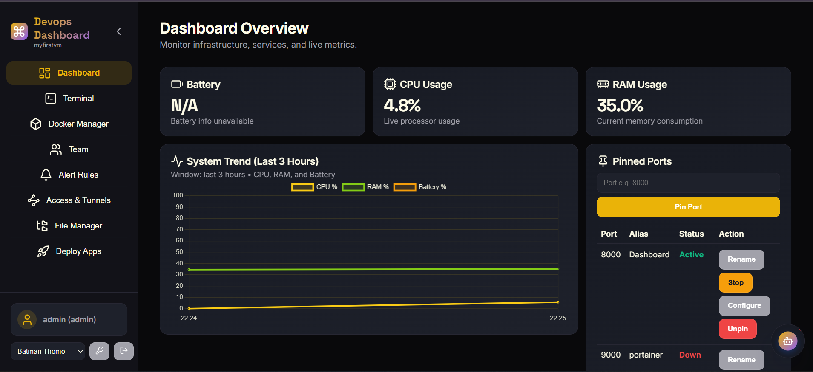
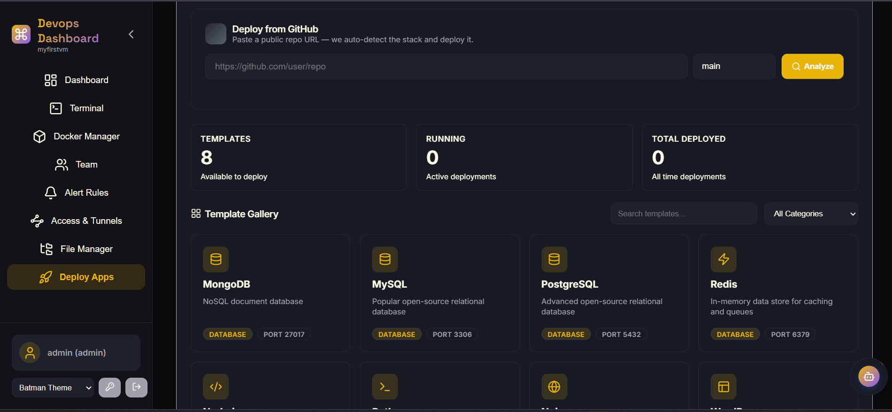
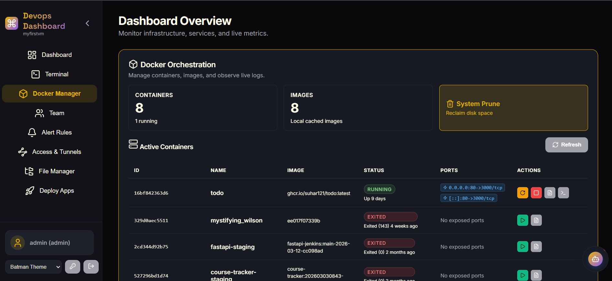
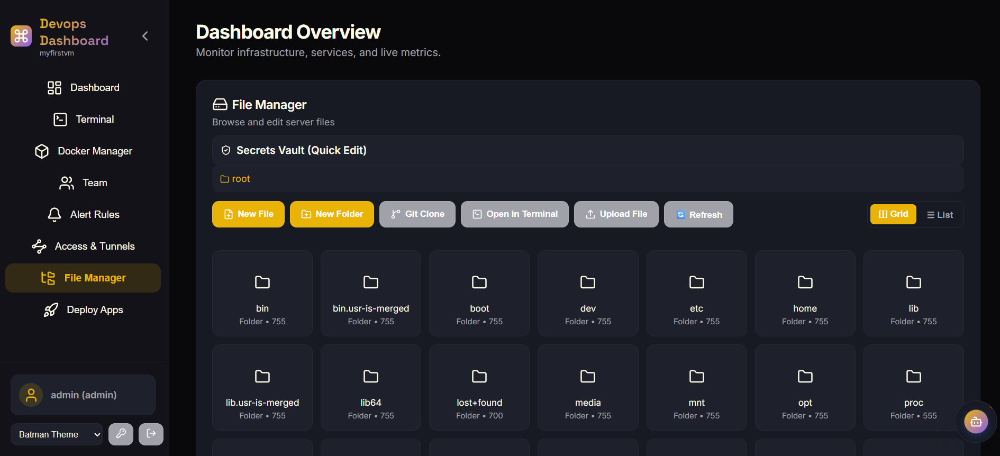
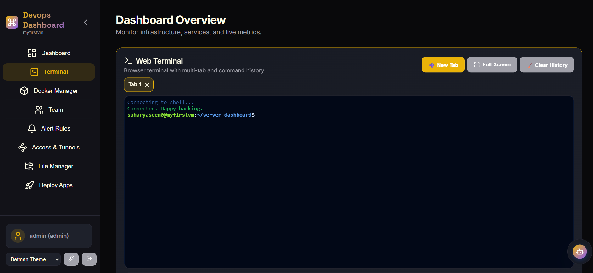

<div align="center">

# DevOps Control Panel

**A self-hosted, full-stack server management dashboard for monitoring, deployment, and administration.**

[](LICENSE)
[](https://www.python.org/)
[](https://fastapi.tiangolo.com/)
[](https://www.sqlite.org/)

<br/>

A lightweight, single-binary operations dashboard built with **FastAPI + SQLite + vanilla HTML/CSS/JS**.
Manage your servers, monitor system health, deploy applications, and access a browser-based terminal — all from one interface.

[Getting Started](#-getting-started) · [Features](#-features) · [Screenshots](#-screenshots) · [API Reference](#-api-reference) · [Contributing](CONTRIBUTING.md)

</div>

---

## Features

| Category | Capabilities |
|---|---|
| **Authentication & RBAC** | Role-based access (`viewer`, `operator`, `admin`), session management, cookie-based auth |
| **System Monitoring** | Live CPU, RAM, battery metrics, CPU trend charts, threshold-based alerts |
| **Port Management** | Open port scanning, pinned port health checks, port change detection (new/closed), Telegram alerts |
| **Docker Visibility** | Container listing, status monitoring via `docker ps` |
| **Service Control** | Start/stop/restart services, log viewing, persistent log storage |
| **App Deployment** | Deploy and manage applications from the dashboard |
| **File Manager** | Browse, read, write, upload, download, chmod, mkdir, Git clone support |
| **Terminal** | Browser-based terminal via WebSocket + PTY, multi-tab sessions, per-tab command history |
| **Saved Commands** | Command library with template variables (`{{var}}`), inline variable forms |
| **Admin Tools** | User lifecycle management, audit logs, SSH key manager, Cloudflared route manager |
| **Notifications** | Telegram bot integration for alerts and custom notifications |

---

## Screenshots

### Dashboard


### App Deployment


### Docker Manager


### File Manager


### Terminal


---

## Getting Started

### Prerequisites

- Python 3.9+
- Linux environment (for `ss`, `docker`, PTY support)
- (Optional) Telegram bot token for notifications
- (Optional) Cloudflared for tunnel management

### Installation

```bash
# Clone the repository
git clone https://github.com/Suhar121/server-dashboard.git
cd server-dashboard

# Create and activate virtual environment
python3 -m venv venv
source venv/bin/activate

# Install dependencies
pip install -r requirements.txt
```

### Configuration

```bash
# Copy the environment template
cp .env.example .env
```

Edit `.env` with your values:

```env
BOT_TOKEN=YOUR_TELEGRAM_BOT_TOKEN
CHAT_ID=YOUR_TELEGRAM_CHAT_ID
SESSION_TIMEOUT_MINUTES=30
USERS_DB_PATH=users.db
ADMIN_USERNAME=admin
ADMIN_PASSWORD=change_this_password
```

### Running

```bash
uvicorn main:app --host 0.0.0.0 --port 8000 --reload
```

Open your browser at `http://127.0.0.1:8000/`

### Optional: Battery Monitor

```bash
python battery.py
```

---

## Environment Variables

| Variable | Description | Default |
|---|---|---|
| `BOT_TOKEN` | Telegram bot token | — |
| `CHAT_ID` | Telegram chat ID | — |
| `SESSION_TIMEOUT_MINUTES` | Session TTL in minutes | `30` |
| `USERS_DB_PATH` | SQLite database file path | `users.db` |
| `ADMIN_USERNAME` | Bootstrap admin username | — |
| `ADMIN_PASSWORD` | Bootstrap admin password (min 8 chars) | — |
| `CLOUDFLARED_CONFIG_PATH` | Cloudflared config file path | `/etc/cloudflared/config.yml` |
| `CLOUDFLARED_FALLBACK_CONFIG_PATH` | Fallback path if primary is not writable | `./cloudflared/config.yml` |
| `CLOUDFLARED_TUNNEL_NAME` | Tunnel name/UUID for DNS routing | — |
| `CLOUDFLARED_DNS_AUTO_ROUTE` | Auto-run `cloudflared tunnel route dns` on route create | `true` |
| `CLOUDFLARED_BIN_PATH` | Cloudflared executable path | `cloudflared` |
| `CLOUDFLARED_DNS_ROUTE_TIMEOUT_SECONDS` | DNS command timeout | `20` |

> **Note:** Never commit real credentials. Keep `.env` local and only share placeholder values in `.env.example`.

---

## Tech Stack

### Backend
- **Python 3** with [FastAPI](https://fastapi.tiangolo.com/)
- **SQLite** for persistent storage
- **psutil** for system metrics
- Native Linux tools: `ss` (ports), `docker` CLI (containers), PTY (`pty`, `fcntl`, `os`, `signal`)

### Frontend
- Single-page `index.html` (no build step, no framework)
- [Chart.js](https://www.chartjs.org/) for CPU trend visualization
- [xterm.js](https://xtermjs.org/) for the web terminal
- [Lucide](https://lucide.dev/) icons
- Responsive CSS with container queries and themed UI

---

## Roles and Permissions

| Role | Access Level |
|---|---|
| **viewer** | Read dashboards, metrics, logs, ports, Docker status |
| **operator** | viewer + service run/stop, todo editing, terminal, file download |
| **admin** | operator + user management, audit logs, alert rules, SSH keys, Cloudflared routes, full file manager, notifications |

**Constraints:**
- The last admin account cannot be deleted or demoted.
- Users cannot delete their own account.
- API docs (`/docs`, `/redoc`, `/openapi.json`) are admin-only.

---

## API Reference

Base URL: `http://127.0.0.1:8000`

<details>
<summary><strong>Authentication</strong></summary>

| Method | Endpoint | Description |
|---|---|---|
| `POST` | `/auth/login` | Login and create session |
| `POST` | `/auth/logout` | Logout and destroy session |
| `GET` | `/auth/me` | Get current user info |

</details>

<details>
<summary><strong>User Management (admin)</strong></summary>

| Method | Endpoint | Description |
|---|---|---|
| `GET` | `/auth/users` | List all users |
| `POST` | `/auth/users` | Create a new user |
| `PATCH` | `/auth/users/{username}/role` | Update user role |
| `DELETE` | `/auth/users/{username}` | Delete a user |

</details>

<details>
<summary><strong>App State</strong></summary>

| Method | Endpoint | Description |
|---|---|---|
| `GET` | `/state/services` | List pinned services |
| `POST` | `/state/services` | Add a pinned service |
| `DELETE` | `/state/services/{service_id}` | Remove a pinned service |
| `GET` | `/state/todos` | List todos |
| `POST` | `/state/todos` | Create a todo |
| `PATCH` | `/state/todos/{todo_id}` | Update a todo |
| `DELETE` | `/state/todos/{todo_id}` | Delete a todo |

</details>

<details>
<summary><strong>Service Control & Logs</strong></summary>

| Method | Endpoint | Description |
|---|---|---|
| `GET` | `/logs/{service}` | Get service logs |
| `POST` | `/run` | Start a service |
| `POST` | `/stop` | Stop a service |

</details>

<details>
<summary><strong>Monitoring & Notifications</strong></summary>

| Method | Endpoint | Description |
|---|---|---|
| `GET` | `/system` | System metrics (CPU, RAM, battery) |
| `GET` | `/ports` | Open ports list |
| `GET` | `/docker` | Docker containers |
| `GET` | `/battery` | Battery status |
| `GET` | `/check-port/{port}` | Check specific port health |
| `POST` | `/notify` | Send Telegram notification (admin) |

</details>

<details>
<summary><strong>Audit & Alert Rules</strong></summary>

| Method | Endpoint | Description |
|---|---|---|
| `GET` | `/audit-logs` | Get audit log entries |
| `GET` | `/alert-rules` | List alert rules |
| `POST` | `/alert-rules` | Create an alert rule |
| `PATCH` | `/alert-rules/{rule_id}` | Update an alert rule |
| `DELETE` | `/alert-rules/{rule_id}` | Delete an alert rule |

</details>

<details>
<summary><strong>SSH Key Manager</strong></summary>

| Method | Endpoint | Description |
|---|---|---|
| `GET` | `/ssh/keys` | List SSH keys |
| `POST` | `/ssh/keys` | Add an SSH key |
| `DELETE` | `/ssh/keys/{key_id}` | Remove an SSH key |

</details>

<details>
<summary><strong>Cloudflared Route Manager</strong></summary>

| Method | Endpoint | Description |
|---|---|---|
| `GET` | `/cloudflared/routes` | List routes |
| `POST` | `/cloudflared/routes` | Create a route |
| `DELETE` | `/cloudflared/routes/{route_id}` | Delete a route |

</details>

<details>
<summary><strong>File Manager</strong></summary>

| Method | Endpoint | Description |
|---|---|---|
| `GET` | `/files/browse` | Browse directory |
| `POST` | `/files/read` | Read file contents |
| `POST` | `/files/write` | Write file contents |
| `POST` | `/files/delete` | Delete a file |
| `POST` | `/files/mkdir` | Create a directory |
| `POST` | `/files/git-clone` | Clone a Git repository |
| `POST` | `/files/chmod` | Change file permissions |
| `GET` | `/files/download` | Download a file |
| `POST` | `/files/upload` | Upload a file |

</details>

<details>
<summary><strong>Terminal</strong></summary>

| Method | Endpoint | Description |
|---|---|---|
| `WS` | `/ws/terminal` | WebSocket terminal session |

</details>

---

## Repository Structure

```
server-dashboard/
├── main.py                    # FastAPI app (API + auth + RBAC + terminal + files + alerts)
├── index.html                 # Full frontend UI and client-side logic
├── battery.py                 # Optional battery monitor script using /notify API
├── .env.example               # Environment template (copy to .env)
├── requirements.txt           # Python dependencies
├── users.db                   # SQLite database (local runtime, gitignored)
├── logs/                      # Service log files (gitignored)
├── docs/
│   └── screenshots/           # README UI screenshot assets
├── tests/                     # Test suite
├── ai/                        # AI integration modules
├── .github/                   # GitHub workflows and config
├── LICENSE                    # MIT License
└── CONTRIBUTING.md            # Contribution guidelines
```

---

## Security

- Passwords are hashed with **PBKDF2-HMAC-SHA256** (150,000 iterations + random salt)
- Session tokens are cryptographically random, stored server-side in-memory
- Session cookie is HTTP-only (`secure=False` currently; set `True` under HTTPS)
- API docs are admin-restricted by middleware
- File manager uses path safety checks (`is_safe_path`)

### Production Hardening Checklist

- [ ] Rotate Telegram token/chat values
- [ ] Set cookie `secure=True` under HTTPS
- [ ] Move session storage to Redis or database
- [ ] Implement strict allowlist-based file path policy
- [ ] Add rate limiting and CSRF protections

---

## Troubleshooting

| Issue | Solution |
|---|---|
| Login fails | Verify admin credentials in `.env`, ensure `users.db` is writable |
| No Docker data | Ensure Docker is installed and `docker ps` works for the running user |
| Port list empty | Ensure `ss` command exists; check Linux permissions |
| Terminal won't connect | Requires `operator` or `admin` role; ensure shell exists (`$SHELL`) |
| Telegram not sending | Check `BOT_TOKEN` and `CHAT_ID`; ensure port is pinned in dashboard |

---

## Known Limitations

- Sessions are in-memory (lost on server restart)
- `run` endpoint uses `shell=True` (powerful but risky)
- File safety checks are denylist-based, not strict allowlist
- No pagination for large directory listings
- No built-in backup/restore for the database

---

## Contributing

Contributions are welcome! Please see [CONTRIBUTING.md](CONTRIBUTING.md) for guidelines.

1. Fork the repository
2. Create a feature branch (`git checkout -b feature/amazing-feature`)
3. Commit your changes (`git commit -m 'Add amazing feature'`)
4. Push to the branch (`git push origin feature/amazing-feature`)
5. Open a Pull Request

---

## License

This project is licensed under the MIT License — see the [LICENSE](LICENSE) file for details.

---

<div align="center">

**Built with FastAPI, SQLite, and vanilla JS**

</div>
